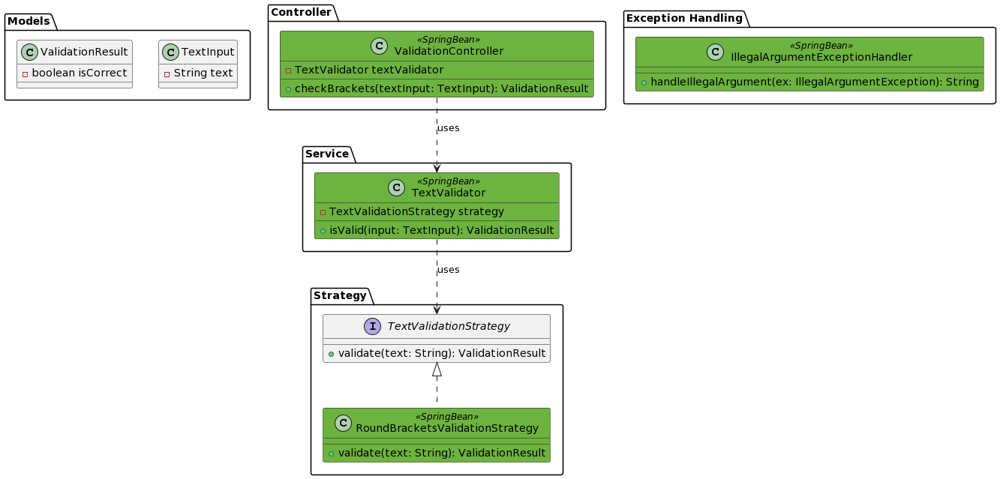

# CheckBrackets App

### Документация по сервису

#### Описание

REST сервис для обработки запросов c текстом, проверка на наличие круглых скобок, возврат true или false в зависимости от корректности расстановки скобок. Явный возврат HTTP 400 Bad Request с описанием в случае пустого текста.

#### Структура



#### Эндпоинты

* /api/checkBrackets

Запускается на порту 8080/TCP.

#### Пререквизиты

jdk-17, Maven, опционально Docker

#### Запуск

Для запуска выполнить сборку:

```
mvn clean test package
```

Перейти в папку с проектом и выполнить:

```
java -jar target/CheckBrackets-0.0.1-SNAPSHOT.jar
```

Либо при использовании Docker:

```
docker build -t checkbrackets .
docker-compose up
```

#### Проверка

* POST запрос к http://localhost:8080/api/checkBrackets с JSON объектом `{ "text" : "текст для проверки" }`
* Спецификация API: http://localhost:8080/swagger-ui/index.html
* Лог приложения доступен в папке logs